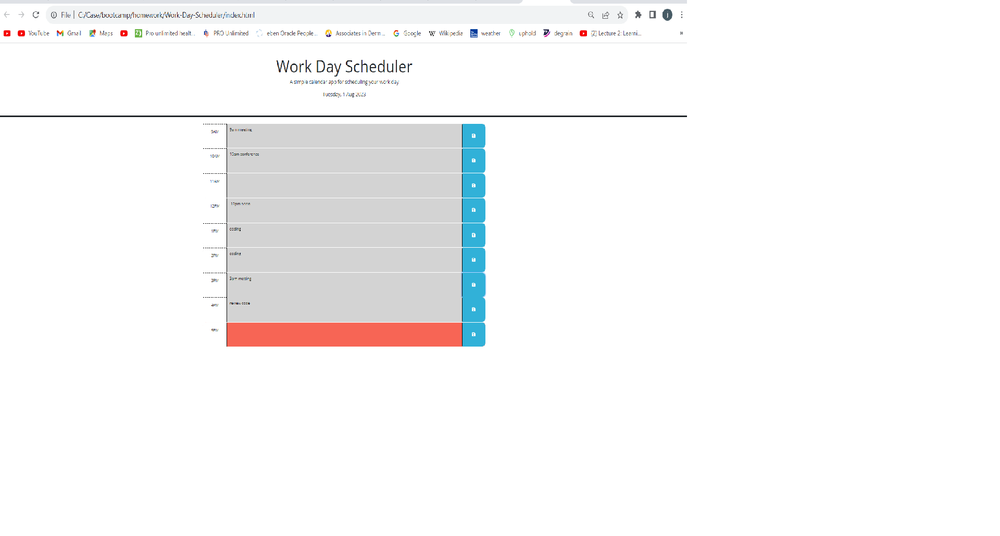

# Work-Day-Scheduler

## Description

This project will create a simple calendar application that allows a user to save events for each hour of a typical working day (9am&ndash;5pm).This app will run in the browser and feature dynamically updated HTML and CSS powered by jQuery.

During this project I used the [Day.js](https://day.js.org/en/) library to work with date and time. I used javascript to interact with the user, media queries to actively adjust display to different screen sizes, as how make better use of CSS by consolidating redundant classes.

## Usage

To use the Workday-Scheduler website, please visit < https://mcgreevyjim66.github.io/Work-Day-Scheduler/>

## Source

My repo, is located at <https://github.com/mcgreevyjim66/Work-Day-Scheduler>.
There is source code located in the Work-Day-Scheduler folder, as well as in the ./assets/images, ./assets/css and ./assets/js folders.

## Mock-up

## Credits

Author: Jim McGreevy
Date:   8/1/2023

